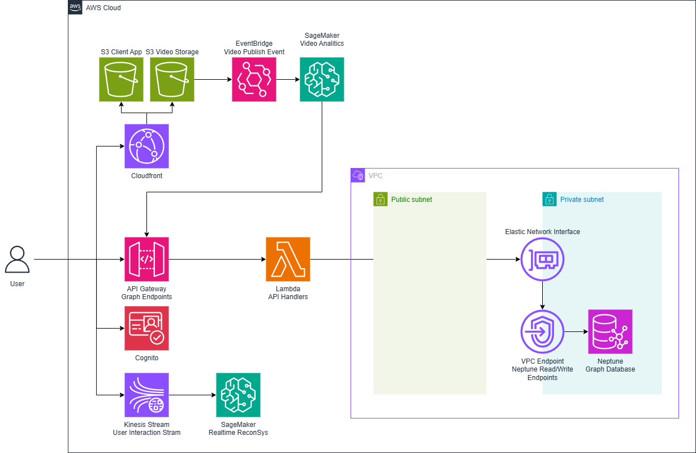

# [WIP] TikTok Clone on AWS

## Architecture Overview

#### User Management and Authentication   
AWS Cognito: Handles user registration, authentication, and authorization. All requests to access resources on AWS are authenticated through Cognito to ensure security and user isolation.
#### Data Storage  
AWS Neptune: Utilized as a graph database to store complex interactions among users, videos, and other entities. Neptune provides a scalable and efficient way to manage and query these relationships.
#### Backend Services  
AWS API Gateway: Acts as the entry point for all client requests. It routes requests to appropriate backend services.
AWS Lambda: Implements the business logic in a serverless manner, ensuring scalability and cost-efficiency.
AWS EventBridge: Facilitates event-driven architecture, enabling seamless integration and communication between different services.
#### Video Storage and Delivery  
AWS S3: Stores video content and static assets.
AWS CloudFront: Distributes content globally with low latency. It serves the React client application as a static website and delivers video content on demand.
#### AI and Machine Learning  
AWS SageMaker: Hosts and manages the AI models used for feature extraction from videos. When a video is published, SageMaker processes it to extract relevant features, which are then stored in Neptune for recommendation purposes.
AWS EventBridge: Triggers the SageMaker processing jobs upon video publication.
AWS SQS: Queues events and ensures reliable communication between services.
#### Real-time Recommendations  
AWS Kinesis Stream: Captures user behavior data in real-time, which feeds into the recommendation system to provide up-to-date content suggestions.
#### Infrastructure as Code  
AWS CloudFormation: Manages and provisions the entire infrastructure using declarative templates, ensuring consistency and ease of deployment.